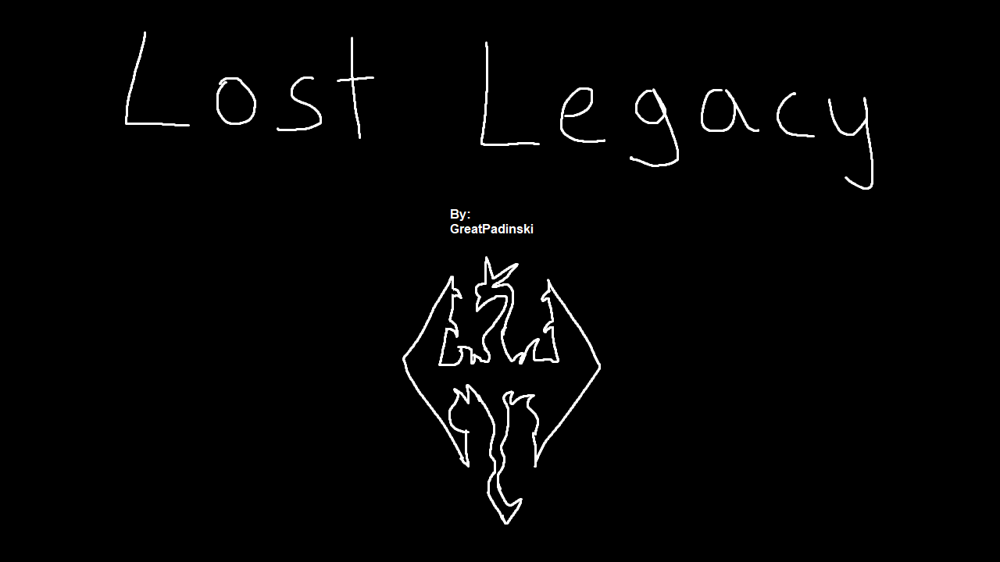

---

  <a href="README.md">Installation</a> ·
  <a href="GAMEPLAY.md">Gameplay Guide</a> ·
  <a href="CONFIGURATION.md">Configuration</a> ·
  <a href="CHANGELOG.md">Changelog</a> ·
  <a href="HELP.md">Help</a>

---

# Changelog

## 0.4.0 Alpha - In-Progress

Added:
- Aetherium Armor and Weapons Compilation (More LotD displays)
- Amulets of Skyrim SSE (More LotD displays)
- Amulets of Skyrim - Tweaks and Fixes
- Apachii Divine Elegance Outfits for Interesting NPCs (SPID)
- Artifacts - The Breton Paladin
- Auri Re-Imagined SE (Song of the Green visual overhaul)
- Cathedral - 3D Snow Berries
- Daedric Shrines - Molag Bal
- Friendly Wisp Orbs
- Friendly Wisp Orbs - Particle Lights for ENB PATCH
- FYX - 3D Whiterun Castle Bridge
- Halted Stream Mine - Lawbringer
- Immersive Cow Tipping (SPID)
- JS Attunement Sphere and Lexicons SE
- JS Attunement Sphere and Lexicons SE - LOTD Display Patch
- Konahrik's Accoutrements (More LotD displays)
- LC_Citadel (Really cool mod, info here: https://www.nexusmods.com/skyrimspecialedition/mods/27059)
- Legacy of the Dragonborn BadGremlins Collection (More LotD displays)
- Legacy of the Dragonborn - Replicas for Good Guys - The Only Cure Quest Expansion - Spellbreaker
- Lucifer - Wyrmstooth
- Lunar Armory - A Silent Moons Overhaul
- M'aiq the Alfiq
- No More of that dumb falling dust thingy in caves
- Oblivion Artifact Pack SE
- Oblivion Artifact Pack SE Cleaned and Upscaled Textures
- Quest Conflict Fixes - Get Aegisbane
- Relationship Change Notifications
- Ryn's Standing Stones - Amulets of Skyrim Patch
- Sales Overflow Solved
- Solstheim Lighthouse
- Solstheim Trading Posts
- Storm Calling Magic
- Teldryn Serious (More LotD displays)
- Teldryn Serious Patch
- Thanedom Assets
- Thanedom Of Darkwater Crossing
- The Black Door - 3D Dagger and Glow - ENB Light
- The Ravens Breezehome SSE
- Traveling Mage - My version SE-AE
- Traveling Mage Armor SPID
- Treasure Hunter (More LotD displays)
- Treasure Hunter for SSE - fixed esp
- Treasure Hunter for SSE - Tweaks and Fixes
- Unaggressive Dragon Priests Fix
- Vigilance Reborn SE
- Whiterun Objects SMIMed
- Wintersun and Artifacts - The Breton Paladin Patch

Player Homes: (separate because there are so many lol)
- Astronomer's Loft -- Small Loft Library Player Home in Whiterun
- Autumngate - A Believable Player Home
- Cityside - A Starter Home
- Dovahkiin's Vault SSE
- Ebongrove
- Ebongrove - Buyable Home Patch
- Elysium Estate SSE
- Elysium Estate SSE - Buyable Home Patch
- Emberbrand Cellar -- Gray Quarter Basement Home
- Frithuz - A Dunmer Home
- Gleamblossom Hollow
- Golzarga - An Orc's Cottage
- Gwent Hearth Falkreath
- LC_Build Your Noble House (Literally build your own keep, this mod is sick!! https://www.nexusmods.com/skyrimspecialedition/mods/18308)
- JK's Riverfall Cottage
- Kalnn - A Vampire's Hobbit Hole
- Menskr - A Winterhold Home
- Myrkheimr SE
- Nimstette - A Cyrodiil Home
- Ouada-Ruhn - A Dunmer Home
- Rawlith - A Khajiit Home
- Sarethi Manor - Morrowind mansion with village
- Shadowstar Castle SE
- Sindora's Hidden Hearth
- Skaunr - An Igloo Home
- Solitude Rectory - Tiny Imperial Temple Home
- Staff of Shalidor
- Staff of Shalidor - Maze Reward
- Swelgn - A Nordic Home
- Tel Aschan - Mage Tower Home
- Tyburn Nook
- Varbaril - A Bosmer Home
- Varbaril - Alternate Key Location ESL
- Vulav - A Cyrodiil Home
- Whiterun Safehold
- Wuth Rein - An ancient nordic hideout

Updated:
- BeastHHBB - Player Character only
- Caught Red Handed - Quest Expansion
- Classic Classes and Birthsigns SSE (Reimagined)
- eFPS - Exterior FPS boost
- eFPS - Official Patch Hub
- Frozen Electrocuted Combustion
- GG's Thieves Guild Headquarters
- Immersive Kaidan Start
- JK's Radiant Raiment
- JK's Riverwood Trader
- JK's The Bee and Barb
- JS Common Cages SE
- JS Dwemer Puzzle Cube SE (Added animations)
- JS Essence Extractor SE
- Mihail Monsters - Bone Colossus
- Mihail Monsters - Gravelords
- Nilheim - Quest Expansion
- Particle Lights for ENB - Light Orbs - Motes
- powerofthree's Papyrus Extender
- Reliquary of Myth - Artifact Overhaul
- Skyrim's Got Talent - Improve As a Bard
- Strange Runes
- The Great Town of Karthwasten Patch Collection
- The Great Town of Shor's Stone Patch Collection
- The Great Village of Kynesgrove Patch Collection
- The Great Village of Mixwater Mill Patch Collection
- The Great Village of Old Hroldan Patch Collection
- Unofficial Lux Patches
- Water for ENB

Removed:
- Conditional tavern cheering (DAR)
- Dark Forest of Skyrim SE - Beyond Reach
- Dark Forest of Skyrim SE - Wyrmstooth
- Eli's Breezehome
- Equipment Toggle (was causing too many CTDs)
- EVG Animation Variance
- EVG Conditional Idles
- Gesture Animation Remix (DAR)
- Lively Children Animations (DAR)
- Mihail Monsters - Bone Colossus Cleaned and Enhanced textures
- Mihail Monsters - Gravelords Cleaned and Enhanced Textures
- Mihail Monsters - Shadow Atronachs
- Mihail Monsters - Snow Whales
- Mihail Monsters - The Mudcrab Merchant
- No Follower Attack Collision
- NPC Animation Remix (DAR)
- Song of the Green - Auri Lenka Replacer

Fixes/Tweaks:
- Honed Metal should work correctly now
- Increased max file handle limit in Engine Fixes (was causing false save corruption)
- Removed BadGremlins/fairy starting note
- Removed Cathedral Meditation starting power
- Removed Lucifer starting note
- Removed 
- Removed Vibrant Weapons starting powers
- Tweaked some encounter zones that were way too high level
- Made lots of custom patches
- Reran Synthesis
- Reran Dyndolod

## 0.3.2 Alpha - Released 2022/05/26

Updated:
- LOTD Hall of Forgotten TCC Patches (I verified the TCC icons show up correctly)
- More Informative Console (fixes the massive delay when console clicking)

Fixes/Tweaks:
- Automated Sunhelm MCM
- Automated Violens MCM (Disabled killmoves, you can enable them in the MCM if you want)
- Disabled Equipment Toggle for now due to some CTD issues with Khajiits and Argonians (can safely enable it for other races)
- Fixed/moved floating note and dagger in Bee and Barb from Xelzaz
- Fixed/moved conflicting objects at Hircine Statue and Moon and Star camp in Falkreath

## 0.3.1 Alpha - Released 2022/05/25

Added:
- C.O.I.N. - Coins of Interesting Natures
- Collectible Dragonling Eggs (More LotD Displays)
- Daedric Shrines - Vaermina (Shrine might look weird on existing saves)
- Equipment Toggle 2
- I'm Glad You're Here - a follower and spouse appreciation mod - SSE
- JS Dwemer Puzzle Cube SE
- More Colorful Collectibles (More LotD displays)
- Pet The Dog - Animations
- The Eyes of Beauty SSE
- Triumvirate - Warlock Summons Volume Down
- Unslaad Weapons and Armors Retexture SE

Updated:
- FYX - 3D Shack Kit Roofs
- FYX - 3D Shack Kit Walls - Collision
- FYX - 3D Stockades - Walls and Gate
- JK's Jorrvaskr
- JK's Sinderion's Field Laboratory
- Legacy of the Dragonborn - Hall of Forgotten
- Legacy of the Dragonborn Unofficial Unslaad Patch
- LOTD Hall of Forgotten TCC Patches
- Lucifer - Argonian Custom Voiced Follower (Should fix CTDs)
- More Informative Console

Fixes/Tweaks:
- ENB tweaks
- More custom patches
- Tweaked some MCMs

## 0.3.0 Alpha - Released 2022/05/22
New Save Required

Added:
- PERFORMANCE MODE (Massive FPS boost, completely different grass and trees)
- New ENB Option - PERFORMANCE Cathedralist Fantasy (Big FPS boost)
- Allow Dialogue Progress Bugfix
- Apachii Divine Elegance Store (Removed the store)
- Apachii Divine Elegance Outfits For NPCs (SPID)
- CLOUDS
- Eastern Dwemer Towers of Solstheim
- FYX - 3D Solitude SighPost
- FYX - Fortified Whiterun Consistency
- Golden Egg Treasure Hunt (More museum displays!)
- Immersive Rejections
- JK's Sinderion's Field Laboratory
- JS Common Cages SE
- JS Dwemer Artifacts
- Lux - JK's Sinderion Lab patch
- Missing in Action Delayed
- Missives - Bigger Trigger Box
- Sufficiently Optimized Snowberries 3D
- Weapon Armor Attribute Tweaks
- Wyrmstooth Suleyk Retexture SE
- [NoDelete] Character Presets (I'll include community character presets here eventually)

Updated:
- AI Overhaul SSE
- Animated Armoury - Fixes
- Audio Overhaul Skyrim - Immersive Sounds Compendium Integration
- Bent Pines II
- Convenient Carriages
- Enhanced Volumetric Lighting and Shadows (EVLaS)
- JK's Interiors Patch Collection
- Legacy of the Dragonborn - Hall of Forgotten
- Legacy of the Dragonborn Patches (Official)
- LOTD Hall of Forgotten TCC Patches
- NPCs Wear Amulets of Mara PLUS
- Paarthurnax - Quest Expansion
- Praedy's Staves AIO Patch Hub
- Reliquary of Myth - Artifact Overhaul
- Soul Cairn Paper Map for FWMF
- SunHelm Survival and needs
- The Wheels of Lull SE
- Xelzaz - Custom Fully Voiced Argonian Telvanni Follower

Removed:
- Animated Armoury - Enchantments (WACCF Version)
- Animated Armoury - WACCF Patch
- Better cage and prisonerstuff SE
- Cathedral - 3D Mountain Flowers
- Cathedral 3D Mountain Flowers - Base Object Swapper
- Immersive Armors __ WACCF
- ISC Weapons Armor Clothing and Clutter Fixes (WACCF) Patch
- MLU - WACCF
- Project ja-Kha'jay- Khajiit Diversity Overhaul
- Rigmor of Bruma - Please be quiet (Seemed to break Rose so the quest would not start)
- Slightly Darker Noise for ENB
- Summermyst - WACCF Patch
- Summermyst Bugfixes for WACCF
- WACCF 4K Textures
- Weapons Armor Clothing and Clutter Fixes

Fixes/Tweaks:
- Moved dyndolod outputs to CDN, greatly reducing the size of the .wabbajack file
- Fixed/removed some clipping trees
- Removed floating gun and ammo in Windhelm Palace
- Grass tweaks
- ENB tweaks
- Made lots of custom patches
- Reran Synthesis
- Reran Dyndolod

## 0.2.0 Alpha - Released 2022/05/07

Added:
- Beards of Power
- Business Ledger HD Retexture
- Combat Music Fix SKSE
- Contextual Crosshair
- CritterSpawn Congestion Fix
- Daedric Shrines - Hermaeus Mora
- ESO Style Cursor (gray, small)
- Face Discoloration Fix
- FYX - 3D Shack Kit Roofs
- Lively Children Animations (DAR)
- Moonpath To Elsweyr Retexture SE
- Sexier Vanilla - Guards
- Wintersun - VR Patch (removes the Pick Your Deity popup on game start)

Updated:
- EVG Conditional Idles
- FYX - 3D Shack Kit Walls (Fixed crashes near shacks)
- Legacy of the Dragonborn - Hall of Forgotten
- Legacy of the Dragonborn Patches (Official)
- Lux
- Project ja-Kha'jay- Khajiit Diversity Overhaul
- Sprint Swimming

Removed:
- Guard Armor Reforged

Fixes/Tweaks:
- Fixed floating lantern in Solitude
- Fixed missing Water in cell 938e near Dragon Bridge
- Removed floating ice chunk near Anga's Mill

## 0.1.0 Alpha - Released 2022/04/30

Initial release
